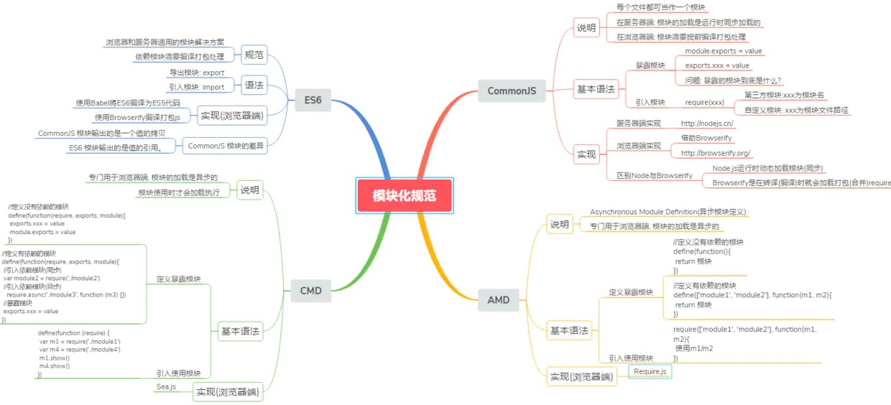

## 1.什么是模块?

* 模块化：就是将独立的功能代码封装成一个文件，其他模块需要使用，在进行引用。
* 模块化有利于代码的拆分和架构上的解耦
* 块的内部数据与实现是私有的, 只是向外部暴露一些接口(方法)与外部其它模块通信




## 2.模块化的进化过程
* __全局function模式：将不同的功能封装成不同的全局函数__  
污染全局命名空间, 容易引起命名冲突或数据不安全，而且模块成员之间看不出直接关系

```
function m1(){
  //...
}
function m2(){
  //...
}
```
* __namespace模式 : 简单对象封装__  
作用: 减少了全局变量，解决命名冲突  
问题: 数据不安全(外部可以直接修改模块内部的数据)

```
let myModule = {
  data: 'www.baidu.com',
  foo() {
    console.log(`foo() ${this.data}`)
  },
  bar() {
    console.log(`bar() ${this.data}`)
  }
}
myModule.data = 'other data' //能直接修改模块内部的数据
myModule.foo() // foo() other data
```
* __IIFE模式：匿名函数自调用(闭包)__  
作用: 数据是私有的, 模块外部不能访问和修改内部变量，外部只能通过暴露的方法操作
编码: 将数据和行为封装到一个函数内部, 通过给window添加属性来向外暴露接口

```
// index.html文件
<script type="text/javascript" src="module.js"></script>
<script type="text/javascript">
    myModule.foo() //foo www.baidu.com
    myModule.bar() //bar www.baidu.com
    console.log(myModule.data) //undefined 不能访问模块内部数据
    myModule.data = 'xxxx' //不是修改的模块内部的data
    myModule.foo() //没有改变
</script>
```
```
// module.js文件
(function(window) {
  let data = 'www.baidu.com'
  //操作数据的函数
  function foo() {
    //用于暴露有函数
    console.log(`foo() ${data}`)
  }
  function bar() {
    //用于暴露有函数
    console.log(`bar() ${data}`)
    otherFun() //内部调用
  }
  function otherFun() {
    //内部私有的函数
    console.log('otherFun()')
  }
  //暴露行为
  window.myModule = { foo, bar } //ES6写法
})(window)

```
* __IIFE模式增强 : 引入依赖__  
这就是现代模块实现的基石
```
// module.js文件
(function(window, $) {
  let data = 'www.baidu.com'
  //操作数据的函数
  function foo() {
    //用于暴露有函数
    console.log(`foo() ${data}`)
    $('body').css('background', 'red')
  }
  //暴露行为
  window.myModule = { foo }
})(window, jQuery)
```
```
 // index.html文件
  <!-- 引入的js必须有一定顺序 -->
  <script type="text/javascript" src="jquery-1.10.1.js"></script>
  <script type="text/javascript" src="module.js"></script>
  <script type="text/javascript">
    myModule.foo()
  </script>
```
上例子通过jquery方法将页面的背景颜色改成红色，所以必须先引入jQuery库，就把这个库当作参数传入。这样做除了保证模块的独立性，还使得模块之间的依赖关系变得明显。

## 3.模块化的好处
* 避免命名冲突(减少命名空间污染)
* 更好的分离, 按需加载 
* 更高复用性 
* 高可维护性  

## 4.模块化规范
* __1.CommonJS__  
Node.js是commonJS规范的主要实践者，它有四个重要的环境变量为模块化的实现提供支持：  
module、exports、require、global。  实际使用时，用module.exports定义当前模块对外输出的接口（不推荐直接用exports），用require加载模块。
```
// 定义模块math.js
var basicNum = 0;
function add(a, b) {
  return a + b;
}
module.exports = { //在这里写上需要向外暴露的函数、变量
  add: add,
  basicNum: basicNum
}

// 引用自定义的模块时，参数包含路径，可省略.js
var math = require('./math');
math.add(2, 5);

// 引用核心模块时，不需要带路径
var http = require('http');
http.createService(...).listen(3000);
```
commonJS用同步的方式加载模块。在服务端，模块文件都存在本地磁盘，读取非常快，所以这样做不会有问题。  
但是在浏览器端，限于网络原因，更合理的方案是使用异步加载。

* __2.AMD和require.js__  
AMD规范采用异步方式加载模块，模块的加载不影响它后面语句的运行。所有依赖这个模块的语句，都定义在一个回调函数中，等到加载完成之后，这个回调函数才会运行。这里介绍用require.js实现AMD规范的模块化：用require.config()指定引用路径等，用define()定义模块，用require()加载模块。  
首先我们需要引入require.js文件和一个入口文件main.js。main.js中配置require.config()并规定项目中用到的基础模块。
```
/** 网页中引入require.js及main.js **/
<script src="js/require.js" data-main="js/main"></script>

/** main.js 入口文件/主模块 **/
// 首先用config()指定各模块路径和引用名
require.config({
  baseUrl: "js/lib",
  paths: {
    "jquery": "jquery.min",  //实际路径为js/lib/jquery.min.js
    "underscore": "underscore.min",
  }
});
// 执行基本操作
require(["jquery","underscore"],function($,_){
  // some code here
});
```
引用模块的时候，我们将模块名放在[]中作为reqiure()的第一参数；如果我们定义的模块本身也依赖其他模块,那就需要将它们放在[]中作为define()的第一参数。
```
// 定义math.js模块
define(function () {
    var basicNum = 0;
    var add = function (x, y) {
        return x + y;
    };
    return {
        add: add,
        basicNum :basicNum
    };
});
// 定义一个依赖underscore.js的模块
define(['underscore'],function(_){
  var classify = function(list){
    _.countBy(list,function(num){
      return num > 30 ? 'old' : 'young';
    })
  };
  return {
    classify :classify
  };
})

// 引用模块，将模块放在[]内
require(['jquery', 'math'],function($, math){
  var sum = math.add(10,20);
  $("#sum").html(sum);
});
```
* __3.CMD和sea.js__   
require.js在申明依赖的模块时会在第一之间加载并执行模块内的代码：
```
define(["a", "b", "c", "d", "e", "f"], function(a, b, c, d, e, f) { 
    // 等于在最前面声明并初始化了要用到的所有模块
    if (false) {
      // 即便没用到某个模块 b，但 b 还是提前执行了
      b.foo()
    } 
});
```
CMD是另一种js模块化方案，它与AMD很类似，  
不同点在于：AMD 推崇依赖前置、提前执行，  CMD推崇依赖就近、延迟执行。  
此规范其实是在sea.js推广过程中产生的。
```
/** AMD写法 **/
define(["a", "b", "c", "d", "e", "f"], function(a, b, c, d, e, f) { 
     // 等于在最前面声明并初始化了要用到的所有模块
    a.doSomething();
    if (false) {
        // 即便没用到某个模块 b，但 b 还是提前执行了
        b.doSomething()
    } 
});

/** CMD写法 **/
define(function(require, exports, module) {
    var a = require('./a'); //在需要时申明
    a.doSomething();
    if (false) {
        var b = require('./b');
        b.doSomething();
    }
});

/** sea.js **/
// 定义模块 math.js
define(function(require, exports, module) {
    var $ = require('jquery.js');
    var add = function(a,b){
        return a+b;
    }
    exports.add = add;
});
// 加载模块
seajs.use(['math.js'], function(math){
    var sum = math.add(1+2);
});
```
* __4.ES6 Module__  
ES6 在语言标准的层面上，实现了模块功能，而且实现得相当简单，旨在成为浏览器和服务器通用的模块解决方案。其模块功能主要由两个命令构成：export和import。export命令用于规定模块的对外接口，import命令用于输入其他模块提供的功能。
```
/** 定义模块 math.js **/
var basicNum = 0;
var add = function (a, b) {
    return a + b;
};
export { basicNum, add };

/** 引用模块 **/
import { basicNum, add } from './math';
function test(ele) {
    ele.textContent = add(99 + basicNum);
}
```

如上例所示，使用import命令的时候，用户需要知道所要加载的变量名或函数名。其实ES6还提供了export default命令，为模块指定默认输出，对应的import语句不需要使用大括号。这也更趋近于ADM的引用写法。

```
/** export default **/
//定义输出
export default { basicNum, add };
//引入
import math from './math';
function test(ele) {
    ele.textContent = math.add(99 + math.basicNum);
}
```
ES6的模块不是对象，import命令会被 JavaScript 引擎静态分析，在编译时就引入模块代码，而不是在代码运行时加载，所以无法实现条件加载。也正因为这个，使得静态分析成为可能。

## 5.ES6 模块与 CommonJS 模块的差异
__1.CommonJS 模块输出的是一个值的拷贝，ES6 模块输出的是值的引用。__  
+ CommonJS 模块输出的是值的拷贝，也就是说，一旦输出一个值，模块内部的变化就影响不到这个值。  
+ ES6 模块的运行机制与 CommonJS 不一样。JS 引擎对脚本静态分析的时候，遇到模块加载命令import，就会生成一个只读引用。等到脚本真正执行时，再根据这个只读引用，到被加载的那个模块里面去取值。换句话说，ES6 的import有点像 Unix 系统的“符号连接”，原始值变了，import加载的值也会跟着变。因此，ES6 模块是动态引用，并且不会缓存值，模块里面的变量绑定其所在的模块。
  
__2.CommonJS 模块是运行时加载，ES6 模块是编译时输出接口。__  
+ 运行时加载: CommonJS 模块就是对象；即在输入时是先加载整个模块，生成一个对象，然后再从这个对象上面读取方法，这种加载称为“运行时加载”。
+ 编译时加载: ES6 模块不是对象，而是通过 export 命令显式指定输出的代码，import时采用静态命令的形式。即在import时可以指定加载某个输出值，而不是加载整个模块，这种加载称为“编译时加载”。


CommonJS 加载的是一个对象（即module.exports属性），该对象只有在脚本运行完才会生成。而 ES6 模块不是对象，它的对外接口只是一种静态定义，在代码静态解析阶段就会生成。

